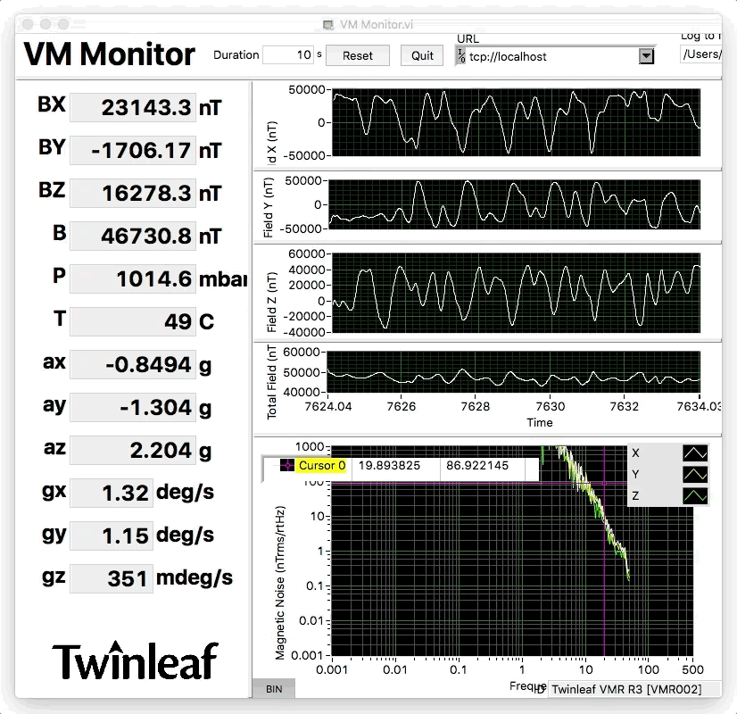
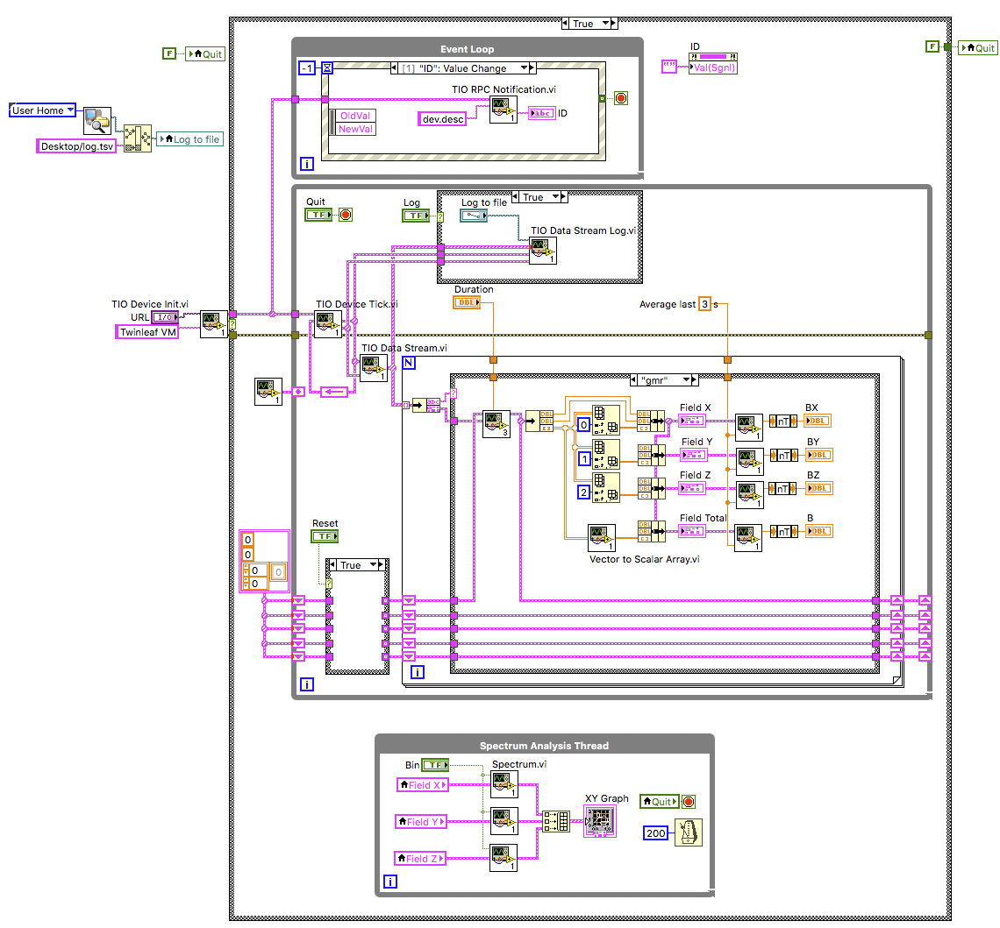

# Labview Twinleaf I/O

This package implements a communications protocol in labview to work with [Twinleaf sensors](http://www.twinleaf.com) using Twinleaf I/O (TIO) as the communications layer. Data from the sensors is received via PUB messages and sensor parameters may be changed using REQ/REP messages.

An included example for monitoring data from a [Twinleaf VMR vector magnetometer](http://www.twinleaf.com/vector/VMR).

## Prerequisites

- [National Instruments Labview 2017](https://ni.com/labview). Conversion to earlier versions are available if requested.
- [National Instruments VISA 2017](https://ni.com/visa) to use the serial port directly.

## Installation

Unzip or clone into the `instr.lib` folder in the Labview installation directory. 

## Use

Several example VIs are available:

  - VM Monitor: view and log data from a [Twinleaf VMR](http://www.twinleaf.com/vector/VMR) sensor.
  - CSB Control: Adjust the output of a [Twinleaf CSB](http://www.twinleaf.com/current/CSB) current supply.

These examples can be called with "url" that is either a serial port (`ASRL47::INSTR`, `COMx`) or a net url such as `tcp://localhost` if using a serial port proxy such as the one in [tio-tools](https://github.com/twinleaf/tio-tools). 

## Programming

The execution is threaded by virtue of three separate loops: an event loop (top), a stream loop (middle), and, in this case, a signal processing loop (bottom). Stream data returns from the `TIO Device Tick` VI and can be converted to a useful array using `TIO Data Stream`. RPC is handled using named queues.

## TODO

  - [ ] Heartbeat
  - [ ] Close port
